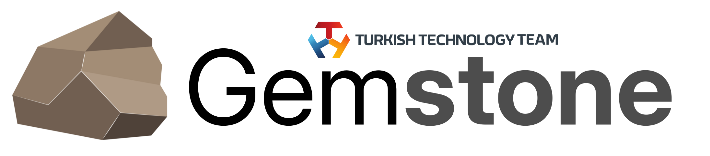
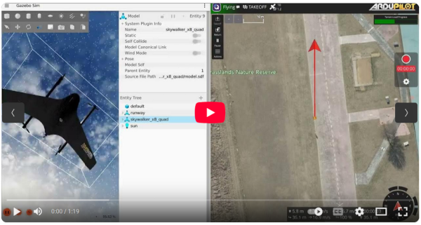
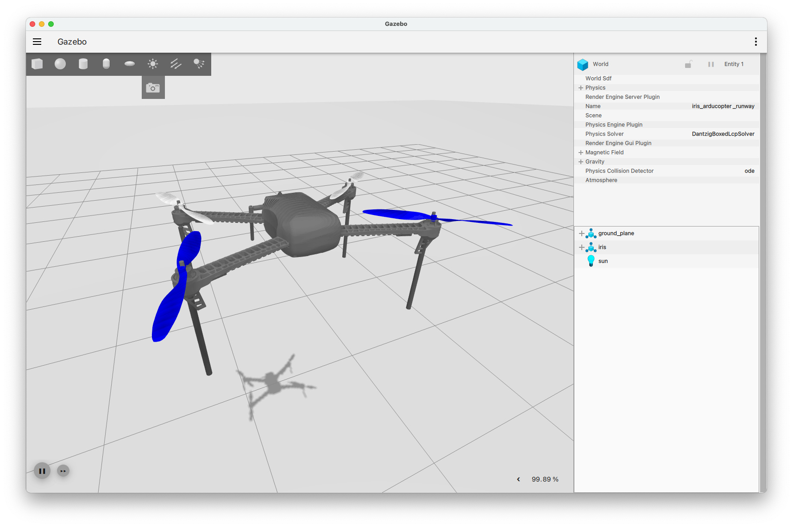
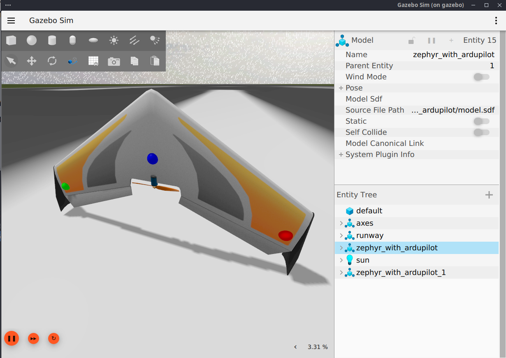

<p align="center">
    <picture>
        <source media="(prefers-color-scheme: dark)" srcset=".meta/logo-dark.png" width="40%" />
        <source media="(prefers-color-scheme: light)" srcset=".meta/logo-light.png" width="40%" />
        
    </picture>
</p>

# Gemstone ArduPilot

[](https://www.t3vakfi.org/en) [](https://opensource.org/licenses/Apache-2.0)

## What is it?

This repository contains the version of the open-source autopilot called ArduPilot that runs on
T3 Gemstone development boards.

All details related to the project can be found at 
[docs.t3gemstone.org/en/projects/ardupilot](https://docs.t3gemstone.org/en/projects/ardupilot).
Below, only a summary of how to perform the building is provided.

## Build

Run all commands in the host PC. ArduPilot is cross-compiled for T3 Gemstone boards using T3 Gemstone Toolchains. 
You can select which vehicle you want to compile by changing the `VEHICLE` variable defined inside `Taskfile.yml`.

##### 1. Clone the project

```bash
git clone https://github.com/t3gemstone/ardupilot
cd ardupilot
git submodule update --init --recursive
```

##### 2. Install Taskfile

```bash
sh -c "$(curl --location https://taskfile.dev/install.sh)" -- -d -b /usr/local/bin
```

##### 3. Compile the project

```bash
VEHICLE=plane task build
```

## Board Setup

Run following command in the host PC. Board setup is automated via SSH connections.

```bash
VEHICLE=plane task build board-setup
```

You need to reboot the board for overlay changes to take effect. After the reboot, ArduPilot should start automatically 
and on-board green LED located to the right of the HDMI port should be blinking.
Check ArduPilot docs to learn
more about [LEDs meaning](https://ardupilot.org/copter/docs/common-leds-pixhawk.html#boards-with-1-or-2-notify-leds).

## Firmware Upload

If you have done Board Setup once and only want to upload new firmware then run the following commands in the host PC:

```bash
VEHICLE=plane task build board-upload
```

## Software-in-the-Loop (SITL)

[](https://www.youtube.com/watch?v=wU4kDhm9MoE)

This repository includes a complete SITL environment for ArduPilot development and testing, orchestrated through Docker
Compose. The setup integrates ArduPilot SITL with QGroundControl and Gazebo simulation for realistic vehicle testing.

### Architecture

The SITL environment consists of three containerized services:

- **ArduPilot SITL**: Flight controller simulation running your vehicle firmware
- **QGroundControl**: Ground control station for mission planning and monitoring
- **Gazebo**: 3D physics simulation environment for realistic vehicle dynamics

### Quick Start

Start the SITL environment:
```bash
task sitl-start
```

Stop the SITL environment:
```bash
task sitl-stop
```

### Connecting to SITL

QGroundControl automatically connects to **14550** UDP port.

### Configuration

SITL parameters are configured in the Taskfile:

```yaml
SITL_LOCATION: ARDUCOPTER_AUTOTEST
SITL_VEHICLE: ArduPlane
SITL_FRAME: gazebo-skywalker-x8-quad
SITL_WORLD: skywalker_x8_quad_runway.sdf
```

**SITL_LOCATION**: Starting location for the simulated vehicle
- Find available locations in [ArduPilot locations.txt](https://github.com/ArduPilot/ardupilot/blob/master/Tools/autotest/locations.txt)
- Examples: `ARDUCOPTER_AUTOTEST`, `KSFO`, `CMAC`

**SITL_VEHICLE**: Vehicle type to simulate
- Examples: `ArduPlane`, `ArduCopter`, `ArduSub`, `Rover`

**SITL_FRAME**: Frame type for vehicle configuration
- Examples: `gazebo-skywalker-x8-quad`, `gazebo-iris`, `gazebo-zephyr`

**SITL_WORLD**: Gazebo world file for simulation environment
- Examples: `skywalker_x8_quad_runway.sdf`, `iris_runway.sdf`, `zephyr_runway.sdf`

After modifying any SITL variables in the Taskfile, restart the environment:

```bash
task sitl-start
```

The Docker Compose configuration will automatically pick up the new environment variables and restart the services with
the updated settings.

### Available Models

| Model                                 | Image                                                                                                                       | SITL_VEHICLE | SITL_FRAME                  | SITL_WORLD                   |
|---------------------------------------|-----------------------------------------------------------------------------------------------------------------------------|--------------|-----------------------------|------------------------------|
| **BiCopter**                          |                   | ArduCopter   | gazebo-bicopter             | bicopter_runway.sdf          |
| **Hexapod Copter**                    |     | ArduCopter   | gazebo-hexapod-copter       | hexapod_copter_runway.sdf    |
| **Iris Copter**                       |                                                                            | ArduCopter   | gazebo-iris                 | iris_runway.sdf              |
| **Alti Transition QuadPlane**         |    | ArduPlane    | gazebo-alti-transition-quad | alti_transition_runway.sdf   |
| **SkyCat TVBS QuadPlane**             |        | ArduPlane    | gazebo-skycat-tvbs          | skycat_runway.sdf            |
| **Skywalker X8 Plane**                |       | ArduPlane    | gazebo-skywalker-x8         | skywalker_x8_runway.sdf      |
| **Skywalker X8 QuadPlane**            |  | ArduPlane    | gazebo-skywalker-x8-quad    | skywalker_x8_quad_runway.sdf |
| **Swan-K1 Tailsitter Quadplane**      |            | ArduPlane    | gazebo-swan-k1-hwing        | swan_k1_hwing_runway.sdf     |
| **Weight-Shift Plane**                |               | ArduPlane    | gazebo-wsc-aircraft         | wsc_aircraft_runway.sdf      |
| **X-UAV Mini Talon V-Tail**           |                        | ArduPlane    | gazebo-mini-talon-vtail     | vtail_runway.sdf             |
| **Zephyr Plane**                      |                                                                          | ArduPlane    | gazebo-zephyr               | zephyr_runway.sdf            |
| **AION R1 Skid-steer Rover**          |                    | Rover        | gazebo-r1-rover             | r1_rover_runway.sdf          |
| **Blue Robotics BlueBoat**            |                   | Rover        | gazebo-blueboat             | waves.sdf                    |
| **Catamaran**                         |                  | Rover        | gazebo-catamaran            | catamaran_waves.sdf          |
| **DAF XF 450 Tractor**                | https://user-images.githubusercontent.com/24916364/149665138-f921ac8d-1082-4822-a28c-d2c07f98ccaa.mov                       | Rover        | gazebo-daf-xf-450-tractor   | daf_truck_runway.sdf         |
| **Omni3 Mecanum Rover**               |                              | Rover        | gazebo-omni3rover           | omnirover_playpen.sdf        |
| **Omni4 Mecanum Rover**               |                              | Rover        | gazebo-omni4rover           | omnirover_playpen.sdf        |
| **Quadruped Rover**                   |          | Rover        | gazebo-quadruped            | quadruped_runway.sdf         |
| **Sawppy Rover**                      |       | Rover        | gazebo-sawppy               | sawppy_playpen.sdf           |
| **Wild Thumper 6WD Skid-steer Rover** |       | Rover        | gazebo-wild-thumper         | wildthumper_runway.sdf       |

Checkout [SITL_Models documentation](https://github.com/ArduPilot/SITL_Models/tree/master/Gazebo/docs) for more
information about Gazebo models.
